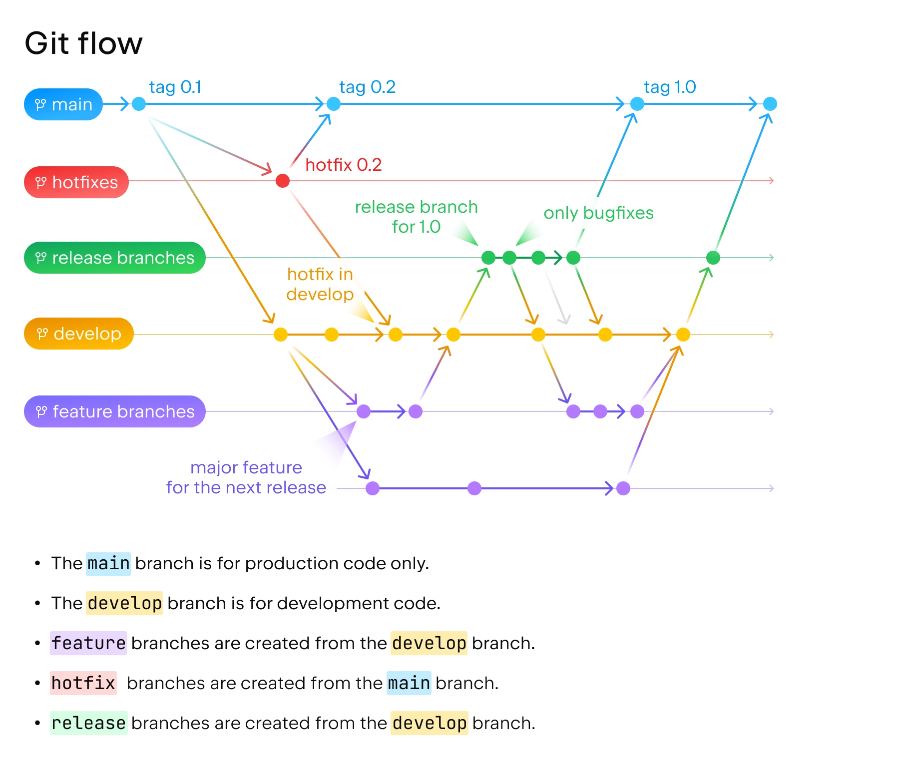

# 1 – Recherche et compréhension
## 1. Présentation de Git Flow :

Gitflow est une extension / un modèle de workflow Git conçu pour apporter de la rigueur à la gestion de version dans les projets d’envergure.

Gitflow est un ensemble de règles simples qui se basent sur le fonctionnement par branche de Git pour séparés les fonctionnalités et usages.

| État / étape                                     | Branche concernée       | Actions & commandes principales                                             | But / rôle                                                                                                                                                                                                                                                                               |
| ------------------------------------------------ | ----------------------- | --------------------------------------------------------------------------- | ---------------------------------------------------------------------------------------------------------------------------------------------------------------------------------------------------------------------------------------------------------------------------------------- |
| **Initialisation**                               | `master` + `develop`    | `git flow init`                                                             | Met en place les branches de base (master, develop) et les préfixes (feature/, release/, hotfix/) ([Les e-novateurs](https://les-enovateurs.com/gitflow-workflow-git-incontournableprojets-de-qualite "Gitflow – Le workflow Git incontournable pour des projets de qualité"))           |
| **Développement d’une fonctionnalité (feature)** | `feature/…`             | `git flow feature start <nom>` puis `git flow feature finish <nom>`         | Travail isolé pour chaque nouvelle fonctionnalité, fusion vers `develop` après validation ([Les e-novateurs](https://les-enovateurs.com/gitflow-workflow-git-incontournableprojets-de-qualite "Gitflow – Le workflow Git incontournable pour des projets de qualité"))                   |
| **Création d’une version (release)**             | `release/…`             | `git flow release start <version>` puis `git flow release finish <version>` | Préparation et tests avant mise en production ; fusion vers `master` + tag + retour vers `develop` ([Les e-novateurs](https://les-enovateurs.com/gitflow-workflow-git-incontournableprojets-de-qualite "Gitflow – Le workflow Git incontournable pour des projets de qualité"))          |
| **Correction urgente en production (hotfix)**    | `hotfix/…`              | `git flow hotfix start <nom>` puis `git flow hotfix finish <nom>`           | Permet de corriger rapidement un bug bloquant directement depuis `master`, et fusionne aussi dans `develop` ([Les e-novateurs](https://les-enovateurs.com/gitflow-workflow-git-incontournableprojets-de-qualite "Gitflow – Le workflow Git incontournable pour des projets de qualité")) |




- Avantages :
	- Historique de projet
	- Grosse structure claire 
	- Travail en parallèle facile
	- Séparation nette entre le développement et la prod

- Limites :
	- Demande de la rigueur
	- Difficile à comprendre au début


## 2. Explication du versionnement sémantique (SemVer) :

L'objectif du Semantic Versioning est de donner un numéro unique à chaque nouvelle version d'un logiciel pour avoir le plus d'inforamtions pour l'utilisateur sur les améliorations/modifications

Un identifiant minimal de version qui ressemble à 0.0.1 se lira tout simplement MAJOR.MINOR.PATCH il est a mettre que sur la branche release et quand elle est mergée sur la main alors elle va ajouter un tag avec le nom de la version sur la main et ensuite la branche release st supprimée

Le chiffre MAJOR est le plus critique, c'est le seul qui indique une évolution de l'API tellement importante que la rétrocompatibilité n'est plus assurée

Le chiffre MINOR permet d'indiquer que des fonctionnalités ont été ajoutées (ou que des fonctionnalités ont été dépréciées) mais que l'API reste compatible avec les anciennes versions.

Le chiffre PATCH indique que des bugs ont été corrigés mais que la rétro-compatibilité est assurée.

| Version  | Type                | Exemple de changements            |
| -------- | ------------------- | --------------------------------- |
| `v1.0.0` |  Release initiale | Version stable de base            |
| `v1.1.0` |  Mineure           | Nouvelles fonctionnalités         |
| `v1.1.1` |  Correctif        | Petit bug corrigé                 |
| `v1.2.0` |  Mineure           | Amélioration UX / fonctionnalités |
| `v2.0.0` |  Majeure          | Refonte complète du code ou BDD   |


## 3. Le rôle du changelog et de la documentation de version :

Le changelog est un fichier nommé CHANGELOG.md, qui retrace l’historique des évolutions du projet entre chaque version.

Il sert à informer clairement les utilisateurs et les développeurs de ce qui a changé, ajouté, corrigé ou supprimé.

### 📝 Exemple
```markdown
## [1.3.0] – 2025-10-07
### Added
- Nouvelle fonctionnalité de recherche avancée (#45)

### Fixed
- Correction du bug sur la page de connexion (#52)

### Changed
- Amélioration du design du tableau de bord
```

La documentation de version, souvent associée au changelog, détaille les changements plus en profondeur (guide de migration, exemples de nouvelles API, instructions de mise à jour, etc.).
Elle complète le changelog en expliquant comment utiliser les nouvelles versions plutôt que simplement ce qui a changé.

## 4. Le lien entre issues, milestones, et releases sur GitHub :

🔹 Issues

Les issues représentent des tâches, bugs ou demandes de fonctionnalités.
Elles servent à suivre le travail à effectuer et peuvent être associées à une branche ou à une pull request.

Exemples :

🐞 Issue #12 – Corriger l’erreur de login

✨ Issue #18 – Ajouter la recherche par filtres

🔹 Milestones

Les milestones regroupent plusieurs issues en un objectif commun (souvent une version ou une étape du projet).
Elles permettent de planifier les priorités et de suivre la progression d’une version.

Exemple :

Milestone v1.3.0 → contient toutes les issues à résoudre avant la sortie de la version 1.3.0.

🔹 Releases

Les releases correspondent aux versions publiées du projet.
Elles sont créées à partir d’un tag Git (souvent lié au versionnement sémantique, ex : v1.3.0) et peuvent inclure :

le changelog associé,

les fichiers binaires ou exécutables,

la description des nouveautés.

Lien entre eux :

Les issues représentent les tâches.

Les milestones regroupent les issues prévues pour une même version.

Quand toutes les issues d’une milestone sont terminées, on crée une release associée.
